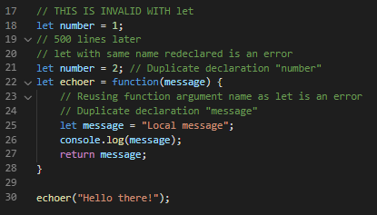

# 01 - Pengantar

## Tujuan Pembelajaran

1. Mahasiswa paham dengan konsep modern javascript
2. Mahasiswa dapat membuat variabel dan parameter lainnya

## Hasil Praktikum

### Listing 1-1
Kode

Hasil

Source

[link](../../src/01_pengantar/1-1.js)

### Listing 1-2
Kode

Hasil

Source

[link](../../src/01_pengantar/1-2.js)

### Listing 1-3
Kode

Hasil

Source

[link](../../src/01_pengantar/1-3.js)

### Listing 1-4
Kode

Hasil

Source

[link](../../src/01_pengantar/1-4.js)

### Listing 1-5
Kode

Hasil

Source

[link](../../src/01_pengantar/1-5.js)

### Listing 1-6
Kode

Hasil

Source

[link](../../src/01_pengantar/1-6.js)

### Listing 1-7
Kode

Hasil

Source

[link](../../src/01_pengantar/1-7.js)

### Listing 1-8
Kode

Hasil

Source

[link](../../src/01_pengantar/1-8.js)

### Listing 1-9
Kode

Hasil

Source

[link](../../src/01_pengantar/1-9.js)

### Listing 1-10
Kode

Hasil

Source

[link](../../src/01_pengantar/1-10.js)

### Listing 1-11
Kode

Hasil

Source

[link](../../src/01_pengantar/1-11.js)

### Listing 1-12
Kode

Hasil

Source

[link](../../src/01_pengantar/1-12.js)

### Listing 1-13
Kode

Hasil

Source

[link](../../src/01_pengantar/1-13.js)

### Listing 1-14
Kode 1

Kode 2

Hasil

Source

[link](../../src/01_pengantar/1-14.js)

### Listing 1-15
Kode 1

Kode 2

Hasil

Source

[link](../../src/01_pengantar/1-15.js)

### Listing 1-16
Kode 1

Kode 1

Hasil

Source

[link](../../src/01_pengantar/1-16.js)
[link](../../src/01_pengantar/1-16.html)

### Listing 1-17
Kode

Hasil

Source

[link](../../src/01_pengantar/1-17.js)
[link](../../src/01_pengantar/1-17.html)

### Listing 1-18
Kode

Hasil

Source

[link](../../src/01_pengantar/1-18.js)

### Listing 1-19
Kode

Hasil

Source

[link](../../src/01_pengantar/1-19.js)

### Listing 1-20
Kode

Hasil

Source

[link](../../src/01_pengantar/1-20.js)

### Listing 1-21
Kode

Hasil

Source

[link](../../src/01_pengantar/1-21.js)

### Listing 1-22
Kode

Hasil

Source

[link](../../src/01_pengantar/1-22.js)