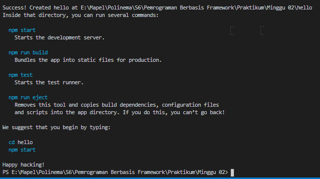

# 02 - Hello World

## Tujuan Pembelajaran

1. Mahasiswa paham dengan konsep ReactJS dan membuat project menggunakan ReactJS

## Hasil Praktikum

1. Pembuatan project melalui command `npx create-react-app hello`

   

2. Pembuatan project berhasil

   

3. Test jalan aplikasi dengan mengetik `cd hello` untuk masuk folder project, kemudian ketik `npm start`. Jika berhasil hasilnya seperti ini

   

4. Ubah kode pada `App.js` dengan mengisi nama dan nim seperti dibawah ini. Simpan dan reload

   

5. Hasil akhir

   

Link `App.js`

[link](../../src/02_layout/App.js)
