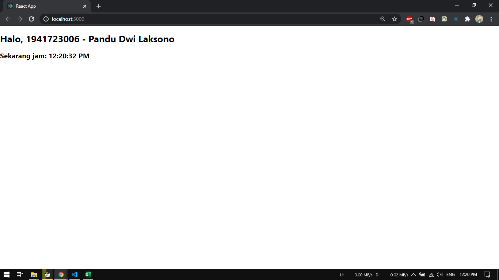

# 03 - Konsep ReactJs

## Tujuan Pembelajaran

1. Mahasiswa paham dengan konsep ReactJS dan membuat project menggunakan ReactJS

## Hasil Praktikum

### Praktikum 1
1. Kode cara pertama

2. Kode cara kedua

3. Hasil

Source :

[link index.js](../../src/03_konsep_reactJs/praktikum1/index.js)

[link index.js kedua](../../src/03_konsep_reactJs/praktikum1/index(percobaan).js)

### Praktikum 2
1. Kode praktikum

2. Hasil

Source :

[link index.js](../../src/03_konsep_reactJs/praktikum2/index.js)

### Praktikum 3
1. Kode praktikum

2. Hasil

Source :

[link index.js](../../src/03_konsep_reactJs/praktikum3/index.js)

### Praktikum 4
1. Kode praktikum `App.js`

2. Kode praktikum `index.js`

3. Hasil

Source :

[link index.js](../../src/03_konsep_reactJs/praktikum4/index.js)
[link App.js](../../src/03_konsep_reactJs/praktikum4/App.js)

### Praktikum 5
1. Kode praktikum

2. Hasil

Source :

[link App.js](../../src/03_konsep_reactJs/praktikum5/App.js)

### Praktikum 6
1. Kode praktikum

2. Hasil 

Source :

[link index.js](../../src/03_konsep_reactJs/praktikum6/index.js)

