# 04 - Konsep ReactJs Bagian 2

## Tujuan Pembelajaran

1. Mahasiswa paham dengan konsep ReactJS dan membuat project menggunakan ReactJS

## Hasil Praktikum

### Praktikum 1 - Menangani events pada toggle button
1. Kode cara pertama

    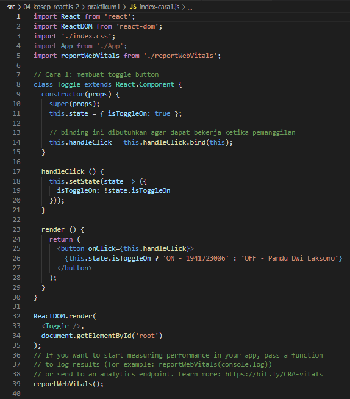

2. Kode cara kedua

    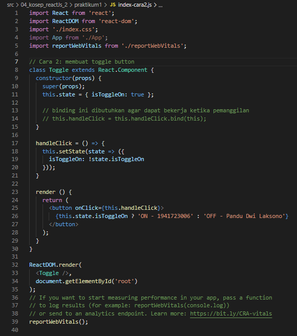

3. Kode cara ketiga

    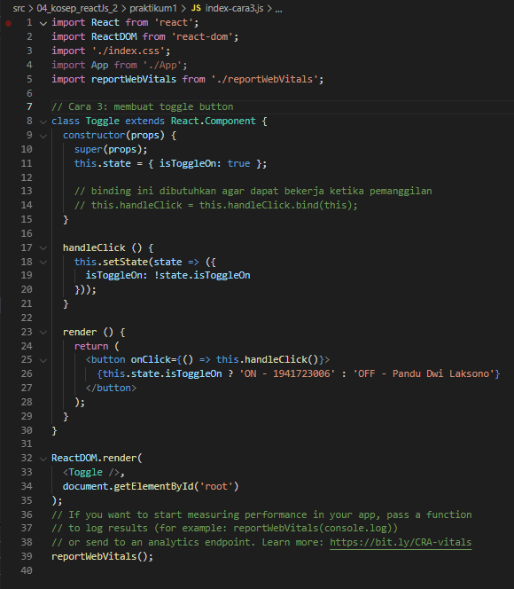

4. Hasil

    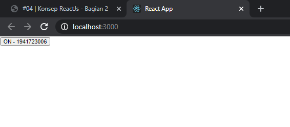
    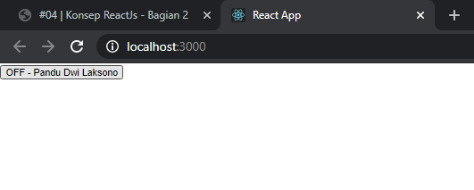

Source :

[link index.js](../../src/04_konsep_reactJs_2/praktikum1/index-cara1.js) 
[link index.js kedua](../../src/04_konsep_reactJs_2/praktikum1/index-cara2.js) 
[link index.js ketiga](../../src/04_konsep_reactJs_2/praktikum1/index-cara3.js)

### Praktikum 2 - Rendering login secara kondisional
1. Kode praktikum

    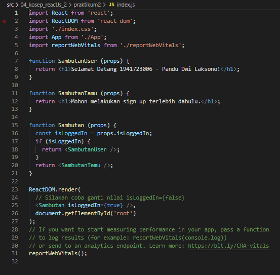

2. Hasil props isLoggedIn true

    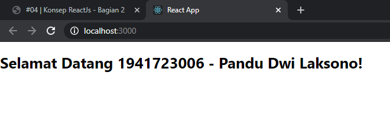

3. Hasil props isLoggedIn false

    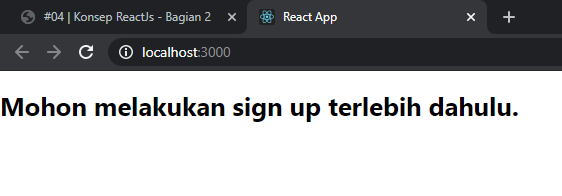

Source :

[link index.js](../../src/04_konsep_reactJs_2/praktikum2/index.js)

### Praktikum 3 - Menyimpan elements dengan variabel
1. Kode praktikum

    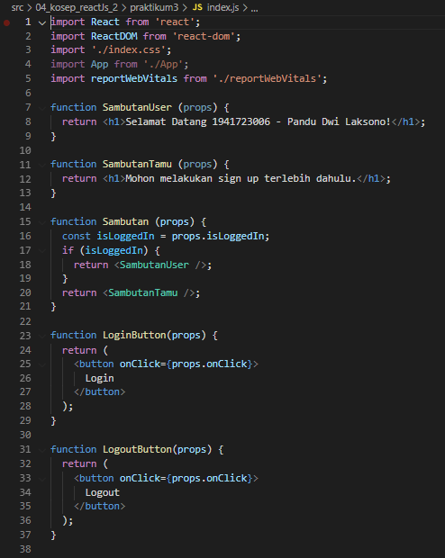
    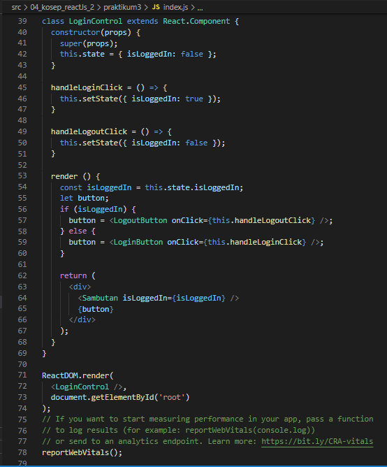

2. Hasil Sebelum Login

    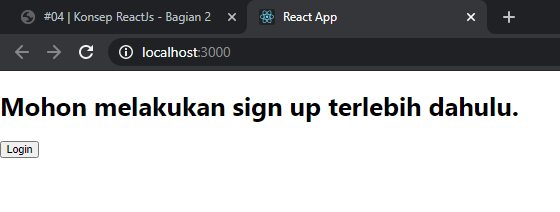

2. Hasil Sesudah Login

    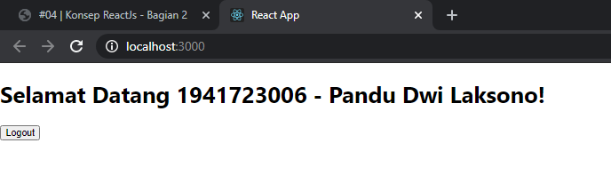

Source :

[link index.js](../../src/04_konsep_reactJs_2/praktikum3/index.js)

### Praktikum 4 - Komponen list dasar
1. Kode praktikum 

    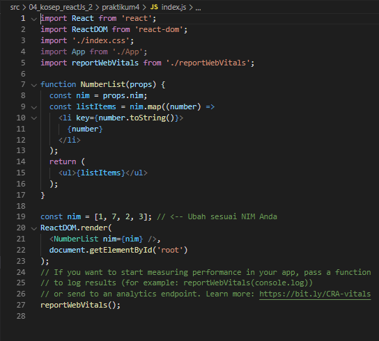

2. Hasil Ketika ada warning

    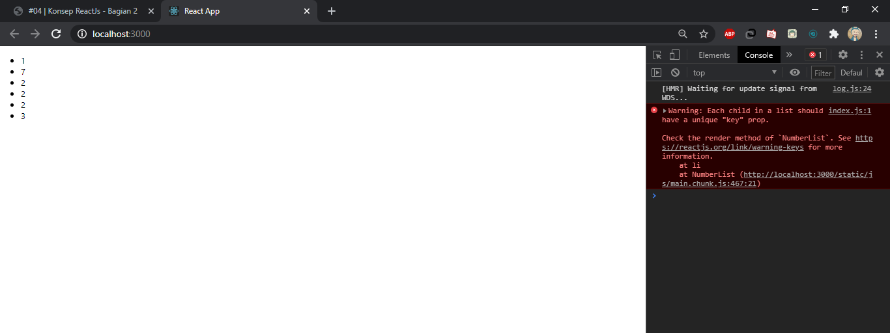

3. Hasil Ketika tidak ada warning

    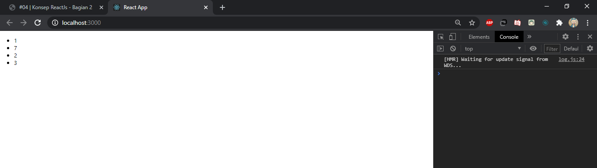

Source :

[link index.js](../../src/04_konsep_reactJs_2/praktikum4/index.js)

### Praktikum 5 - Membuat unique keys
1. Kode praktikum

    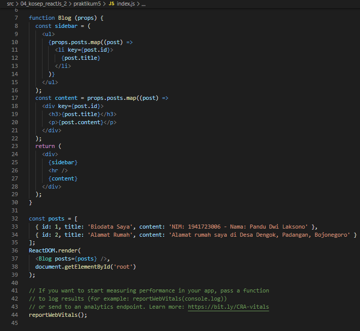

2. Hasil

    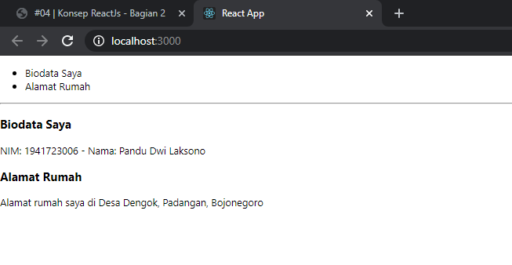

Source :

[link index.js](../../src/04_konsep_reactJs_2/praktikum5/index.js)

### Praktikum 6 - Membuat form dengan controlled components
1. Kode praktikum form

    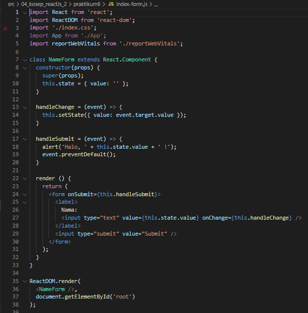

2. Hasil form

    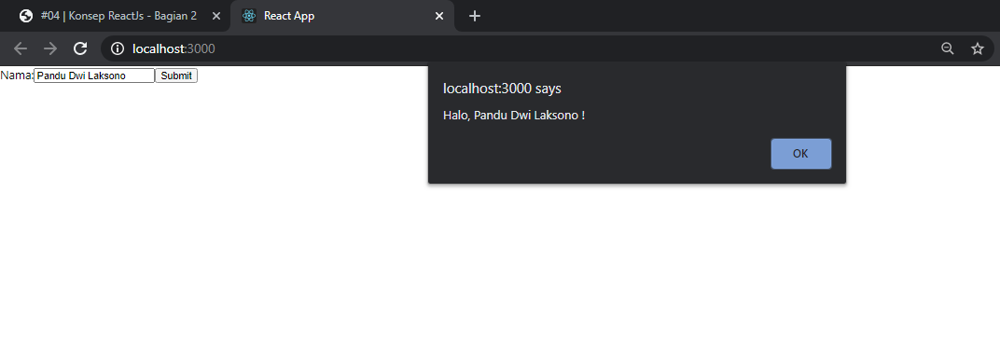

Source :

[link index-form.js](../../src/04_konsep_reactJs_2/praktikum6/index-form.js)

1. Kode praktikum textarea

    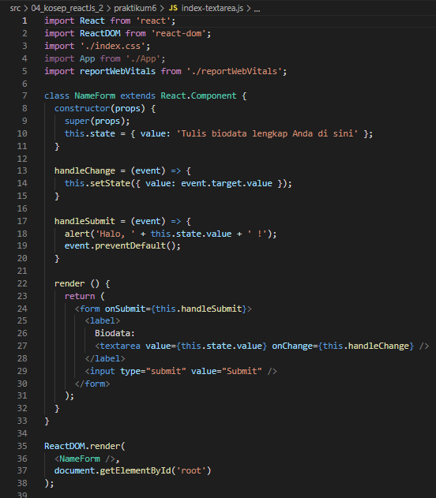

2. Hasil textarea

    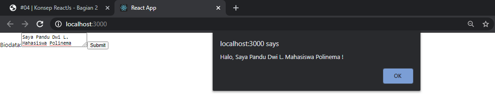

Source :

[link index-textarea.js](../../src/04_konsep_reactJs_2/praktikum6/index-textarea.js)

1. Kode praktikum select dan multiple select

    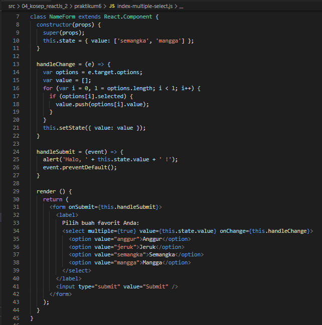

2. Hasil select

    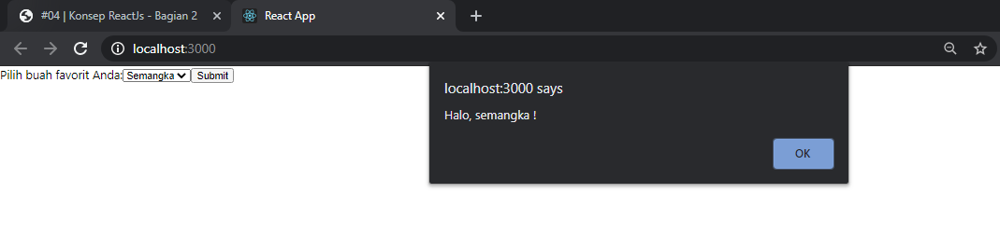

3. Hasil multiple select

    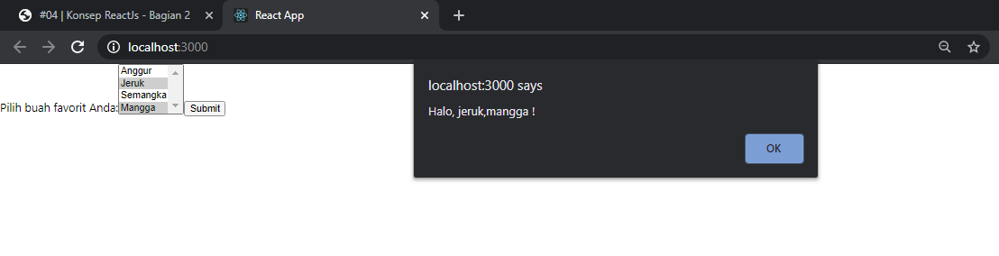

Source :

[link index-multiple-select.js](../../src/04_konsep_reactJs_2/praktikum6/index-multiple-select.js)

