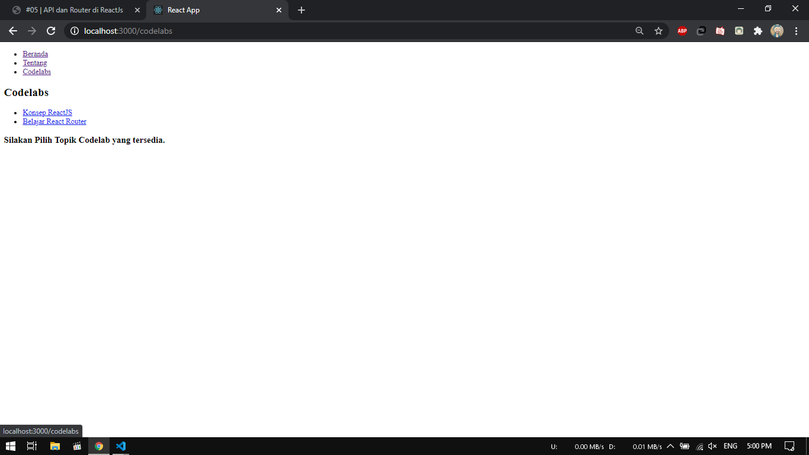
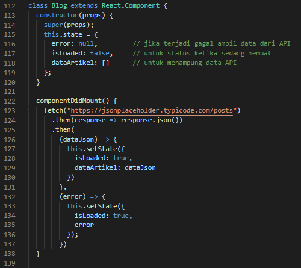
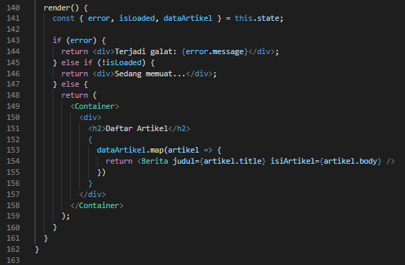

# 05 - API dan Router di ReactJs

## Tujuan Pembelajaran

1. Mahasiswa paham dengan cara instalasi reactrouter 
2. Mahasiswa dapat mengetahui konsep reactrouter

## Hasil Praktikum

### Praktikum 1 - Menampilkan data dari API
1. Membuat Komponen DaftarArtikel

    

2. Membuat class Blog dengan extended React Component

    

3. Menambahkan method componentDidMount kedalam class Blog

    

4. Menambahkan method render kedalam class Blog

    

5. Hasil

    

Source :

[link index.js](../../src/05_api_router_reactJs/praktikum1/index.js)

### Praktikum 2 - Rendering login secara kondisional
1. import `react-router-dom`

    

2. Membuat 3 komponen

    

3. Membuat komponen App

    

4. Merubah isi `index.js`

    

5. Hasil menu beranda

    

6. Hasil menu tentang

    

Source :

[link index.js](../../src/05_api_router_reactJs/praktikum2/index.js)
[link App.js](../../src/05_api_router_reactJs/praktikum2/App.js)

### Praktikum 3 - Membuat routing bersarang (Nested Routing)
1. import yang dibutuhkan

    

2. Membuat komponen beranda dan tentang

    

3. Membuat komponen Codelabs dan Topik. Komponen Codelabs berisi route atau link yang akan ditampilkan ke fungsi render() nantinya.

    

4. buat komponen utama yaitu `App()` yang berisi menu atau daftar link utama.

    

5. Hasil Menu Codelab

    

6. Hasil Menu Codelab Konsep ReactJS

    

7. Hasil Menu Codelab Belajar React Router

    

Source :

[link App.js](../../src/05_api_router_reactJs/praktikum3/App.js)

## Tugas

1. Menginstall react boostrap menggunakan npm

    

2. Import fitur boostrap dan css kedalam file 

    

3. Membuat komponen beranda yang berisi deskripsi mata kuliah dan project

    

4. Membuat komponen tentang yang berisi data diri

    

5. Membuat komponen berita yang berisi data API dari https://jsonplaceholder.typicode.com/posts

    

6. Membuat komponen Topik dan Codelabs untuk menampilkan topik - topik praktikum di modul

     
    

7. Membuat komponen Blog

     
    

8. Membuat komponen App

    

9. Hasil Beranda

    

10. Hasil Berita

    

11. Hasil Tentang

    

12. Hasil Codelab Konsep ReactJS

    

13. Hasil Codelab Belajar React Router

    

Source :

[link index-form.js](../../src/05_api_router_reactJs/tugas/index-form.js) 
[link App.js](../../src/05_api_router_reactJs/tugas/App.js) 
[link package.json](../../src/05_api_router_reactJs/tugas/package.json)