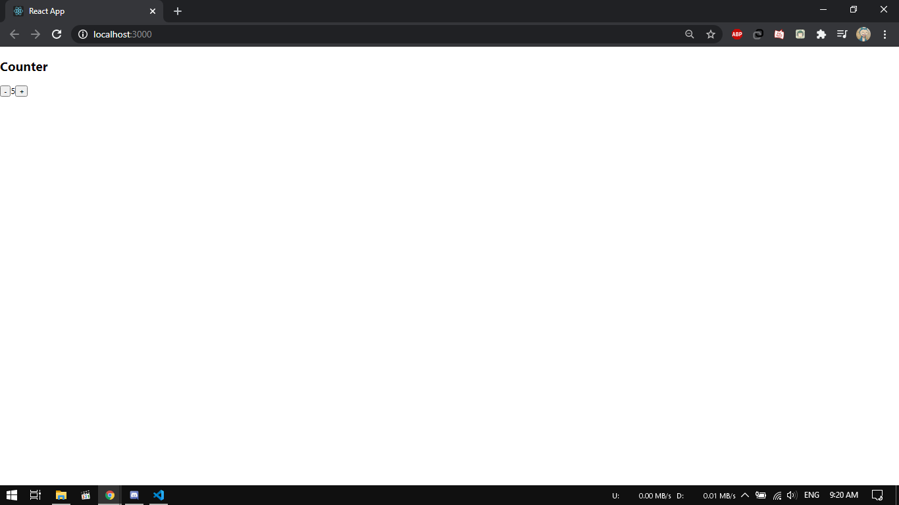
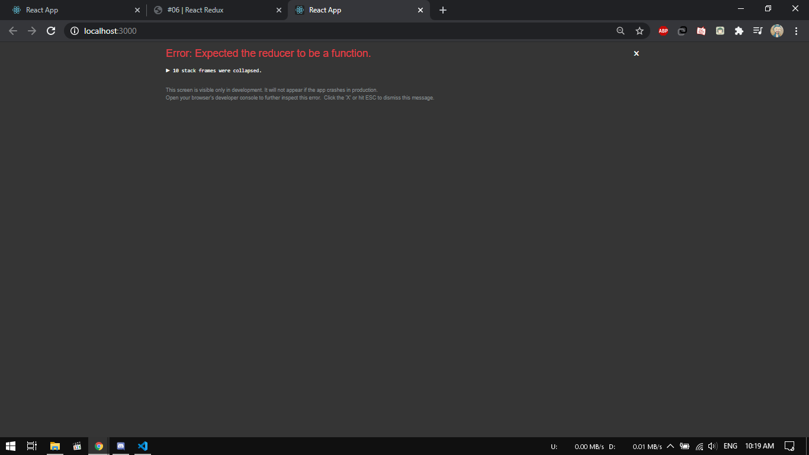
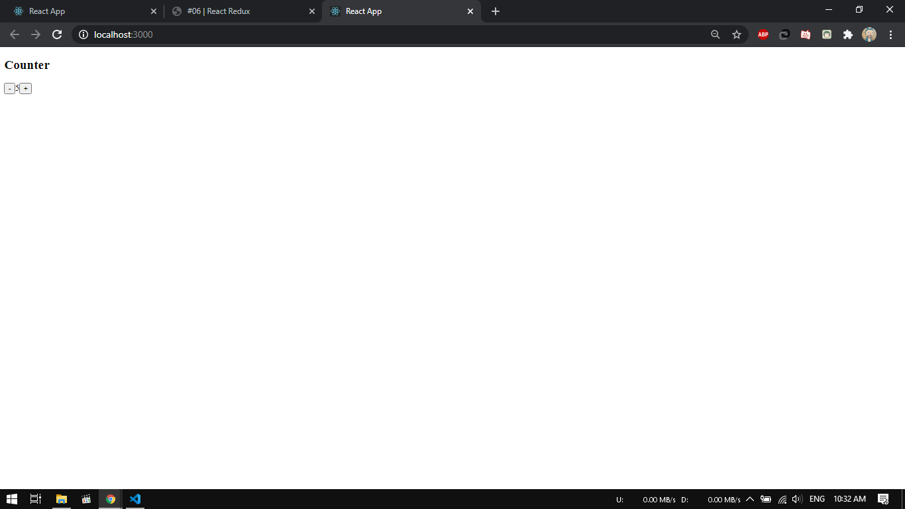
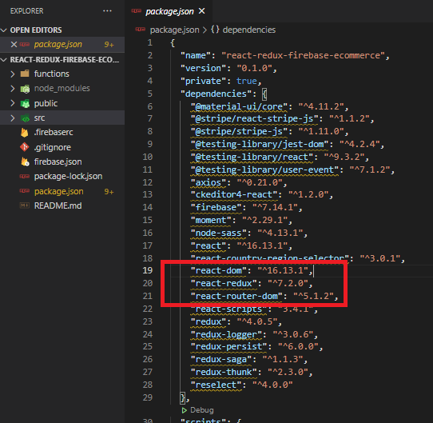
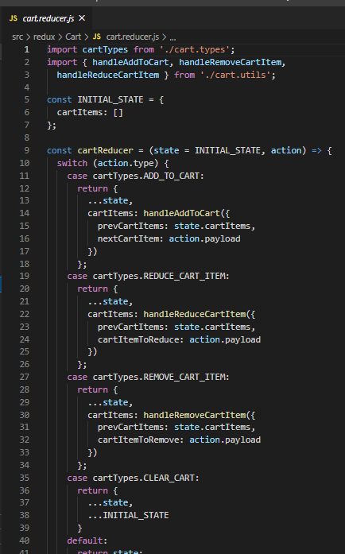

# 06 - State Management dengan Redux

## Tujuan Pembelajaran

1. Mahasiswa dapat memahami konsep state management dalam redux
2. Mahasiswa dapat menerapkan redux dalam reactapp

## Hasil Praktikum

### Praktikum 1 - Menampilkan data dari API
1. Hasil count tanpa redux

    
    

2. Error saat menambahkan reducer

    

3. Mengatur count menjadi 42 tetapi masih setatis

    

4. Menambahkan variabel initialState

    

5. Hasil akhir 

    
    

Source :
[link index.js](../../src/06_react_redux/src/index.js) 
[link App.js](../../src/06_react_redux/src/App.js) 

## Tugas

### Pertanyaan
1. Jelaskan maksud sintaks `this.props.dispatch` pada praktikum sebelumnya!

    Jawab :

    Maksud dari sintaks diatas ialah untuk mengubah state yang terdapat pada store

2. Jelaskan maksud istilah yang ada dalam Redux berikut ini:

    Jawab :

    a. *Action* = merupakan sebuah object yang memiliki property type (https://medium.com/skyshidigital/dasar-membuat-perubahan-state-aplikasi-redux-5bd607a5d831)

    b. *Reducer* = bagian redux yang merubah state menjadi respon yang terjadi ketika Action di `dispatch()` (https://medium.com/skyshidigital/dasar-membuat-perubahan-state-aplikasi-redux-5bd607a5d831)

    c. *Action Creators* = pembuatan action (https://medium.com/skyshidigital/dasar-membuat-perubahan-state-aplikasi-redux-5bd607a5d831)

    d. *Middleware* = sebuah alat yang digunakan untuk merubah hasil dari request sebelum masuk menjadi response

    e. *Pure Function* = sebuah kondisi dimana sebuah fungsi tidak boleh mengubah input value yang diberikan ()

    f. *Immutability* = value yang tidak dapat dirubah secara langsung (https://code.tutsplus.com/id/tutorials/getting-started-with-redux-why-redux--cms-30349)

3. Jelaskan maksud sintaks `export default connect(mapStateToProps)(Counter)` pada praktikum!

    Jawab : mengeksport komponen Counter yang terhubung dengan Store

    Source : https://medium.com/@findforhad/redux-mapstatetoprops-and-mapdispatchtoprops-explained-ea48d41708dc 

4. Carilah sebuah studi kasus aplikasi yang cukup kompleks di GitHub yang  memanfaatkan Redux! Kemudian screenshot bagian kode program mana yang merupakan proses Redux dan jelaskan prosesnya! (cantumkan link repository GitHub yang Anda temukan)

    Jawab :

    Disini saya mengambil sebuah repository project di github dengan nama **E-commerce website using React, Redux, Hooks, Stripe and Firebase**

    Untuk pengecekan pada repository apakah menggunakan redux dapat dilihat pada `package.json`

    

    Untuk contoh penggunaan redux saya ambil file `cart.reducer.js`

    

    Pada kode diatas dilakukan import dari beberapa file lain untuk handle. Kemudian dibuat sebuah initial state yaitu berupda data dalam cartItems bertipe array. Kemudian pada cartReducer diatur state berupa INITIAL_STATE. Kemudian ditambahkan switch case untuk kondisi pada cart yaitu :
    - menambahkan item ke keranjang belanja (ADD_TO_CART)
    - mengurangi  barang di keranjang (REDUCE_CART_ITEM)
    - menghapus barang di keranjang (REMOVE_CART_ITEM)
    - membersihkan keranjang belanja (CLEAR_CART)

    Link Repository : https://github.com/simpletut/React-Redux-Firebase-eCommerce-Website