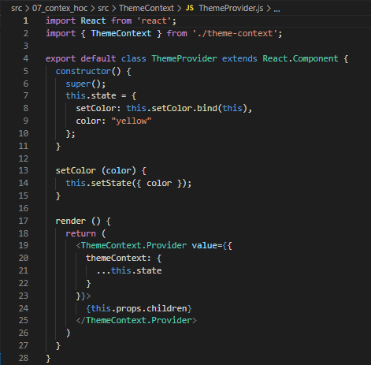

# 07 - Contex dan HOC

## Tujuan Pembelajaran

1. Mahasiswa dapat memahami Konsep Context dan manfaatnya
2. Mahasiswa dapat memahami Konsep HOC di ReactJS

## Hasil Praktikum

### Praktikum - Membuat Tema Aplikasi Sederhana

1. Buat project React baru dengan perintah di console: `npx create-react-app theme-app`
2. Buatlah folder baru bernama **ThemeContext** di dalam folder src, sehingga menjadi `src/ThemeContext`.
3. Buatlah file `theme-context.js` di src/ThemeContext

    

4. Buatlah file `withTheme.js` di src/ThemeContext

    

5. Kemudian buatlah file `ThemeProvider.js` di src/ThemeContext

    

6. Buatlah file di `src/Menu.js`

    

7. Buatlah file di `src/SetColor.js`

    

7. Ubah `App.js`

    

8. Hasil Ketika Dijalankan

    

9. Hasil ketika button red ditekan    

    

10. Hasil ketika button blue ditekan

    