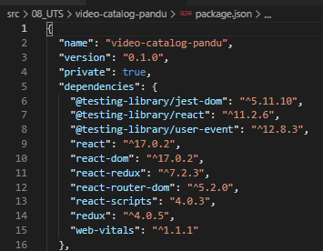
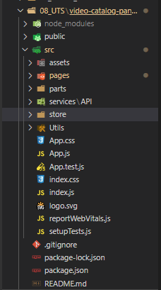
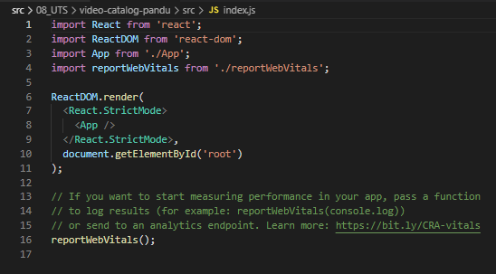
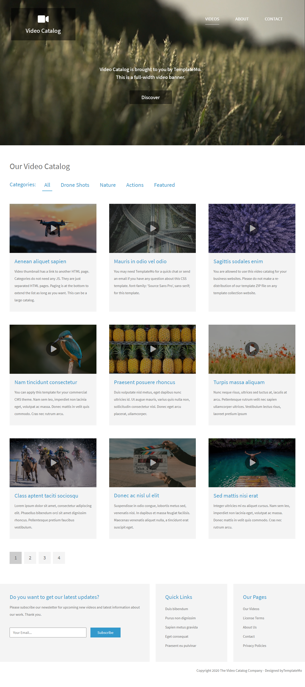
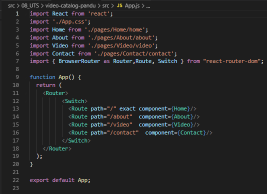
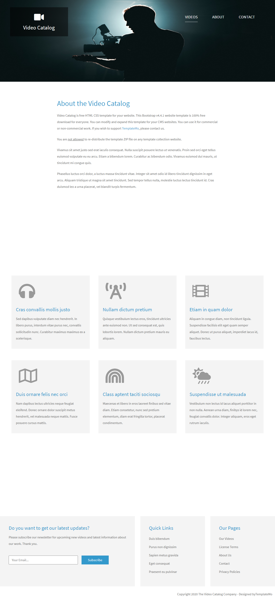
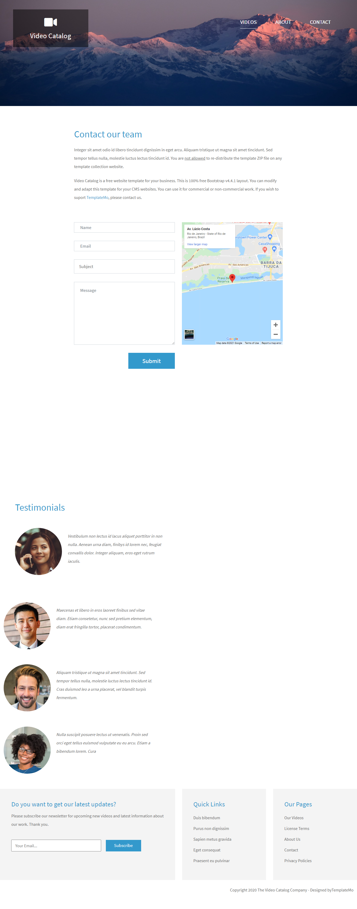
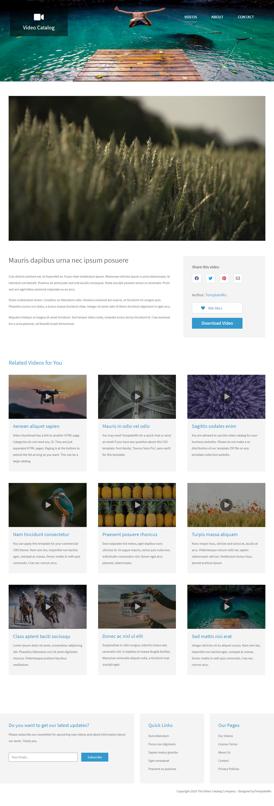
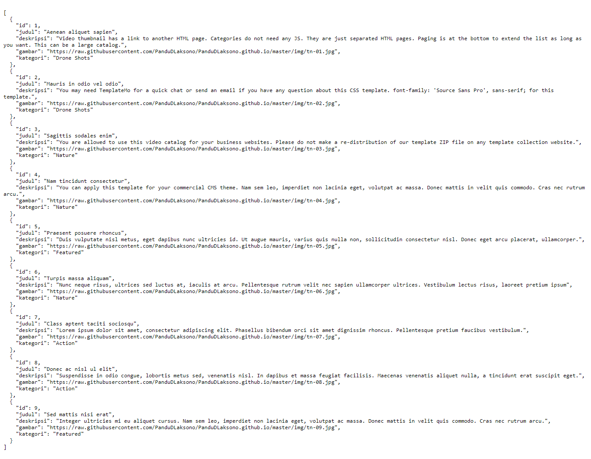
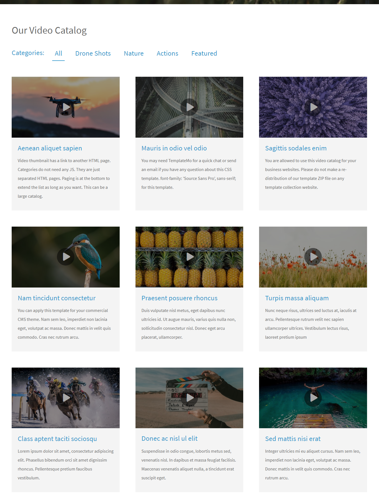

# 08 - UTS

## Tujuan Ujian

1. Mahasiswa dapat merubah web html statis menjadi aplikasi React

## Hasil Ujian

### Import modul npm
1. Import modul yang akan digunakan yaitu 
    - `npm install react-router-dom` = untuk routing halaman di web
    - `npm install redux react-redux --save` = untuk menambahkan redux kedalam project

2. Jika berhasil maka dapat dilihat pada `package.json` di folder project

    

### Penggunaan SPA React
1. Project ini menggunakan Single Page Aplication (SPA) atau ReactJs sebagai framework web dapat dilihat dari struktur folder
    
    

2. Kemudian pada `index.js` yang berisi sebagai berikut. pada `index.js` , diimport file `App.js` yang menghubungkan ke bagian - bagian lain pada web

    

3. Berikut hasil dari perubahan web dari html statis ke ReactJs. Memang tidak terlihat perbedaannya jika dari tampilan awal

    

### Penggunaan Route untuk Berpindah Halaman
1. Pada transisi antar page digunakan route yang telah diimport sebelumnya
2. Untuk route halaman diletakan pada `App.js`. Jangan lupa dilakukan import tiap halaman yang akan dilakukan routing

    

3. Berikut merupakan hasil dari route halaman about

    

4. Berikut merupakan route pada halaman contact

    

5. Berikut merupakan route pada halaman detail artikel

    

Source : App.js

[link App.js](../../src/08_UTS/video-catalog-pandu/src/App.js) 

### Penggunaan API
1. Pada penggunaan API saya tempatkan pada saat pengambilan data artikel katalog video
2. Berikut merupakan isi dari file json yang digunakan untuk pemanggilan API
    
    

3. Untuk output ditempatkan pada halaman beranda (`home.js`)

    

Source 
- API : https://my-json-server.typicode.com/PanduDLaksono/PanduDLaksono.github.io/blog 
- `api.js` : [link api.js](../../src/08_UTS/video-catalog-pandu/src//services/API/api.js) 