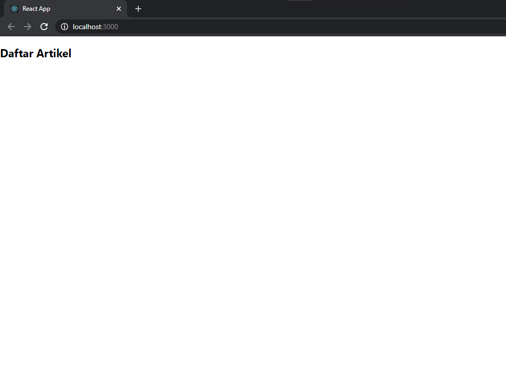

# 09 - Global API & Hooks

## Tujuan Pembelajaran

1. Konsep dan implementasi Global API
2. Konsep dan implementasi Hooks

## Hasil Praktikum - Membuat Global API

### Membuat Global API service GET
1. Buat konstanta baseUrlApi di `src/services/index.js` sebagai alamat url utama API yang digunakan. 
    
    

2. Kemudian buat konstanta `GetAPI` untuk service GET.

    

3.  Buat konstanta `getNewsBlog` untuk mendapatkan isi artikel. Dalam konstanta ini terdapat fungsi yang memanggil GetAPI berisi parameter posts yang diurutkan secara descending berdasarkan atribut id.

    

4. Buat konstanta API yang nanti akan diisi service GET, POST, dan DELETE.

    

5. Buat komponen DaftarArtikel di `src/components/BlogPost.js` untuk menampilkan isi artikel.

    

6. Selanjutnya membuat class `BlogPost`

    

7. Ubah isi `App.js` untuk memanggil BlogPost

    

8. Hasil

    

9. Data artikel belum muncul karena file json dan json server belum diatur

### Membuat Restful API Lokal
1. Buat file `listArtikel.json` pada direktori root project dan isi file tersebut dari https://jsonplaceholder.typicode.com/posts

    

2. Buka terminal baru dan jalankan perintah `json-server --watch listArtikel.json --port 3001` untuk menjalankan json server

    

3. Hasil. Data Artikel berhasil muncul

    

### Membuat Global API Service POST

1. Buka file `src/services/index.js` dan tambahkan kode POST berikut ini.

    

2. Kemudian tambahkan konstanta postNewsBlog untuk data yang dikirim.

    `const postNewsBlog = (dataYgDikirim) => PostAPI('posts', dataYgDikirim);`

3. Pada konstanta API, tambahkan seperti berikut

    

4. Kemudian bagian `render()` kita tambahkan form untuk submit artikel seperti kode berikut.

    

5. Buat fungsi `handleTombolSimpan` di dalam class BlogPost

    

6. Lalu buat fungsi `handleOnChange`

    

7. Hasil

     
     
    

### Membuat Global API Service DELETE
1. Buka file `src/services/index.js` dan tambahkan kode DELETE berikut ini.

    

2. Kemudian tambahkan konstanta deleteNewsBlog untuk data yang dikirim.

    `const deleteNewsBlog = (dataYgDihapus) => DeleteAPI('posts', dataYgDihapus);`

3. Lalu tambahkan deleteNewsBlog ke bagian konstanta API

    

4. Selanjutnya pada file `BlogPost.js` bagian fungsi `render()` tambahkan tombol Hapus.

    

5. Terakhir buat fungsi `handleTombolHapus`

    

6. Hasil

     
     
    

### Mengelola Global API Service
1. Buat folder baru di `src/services/API` dan `src/services/Artikel` beserta file baru didalamnya

    

2. Isi file `Config.js` seperti berikut

    

3. Kemudian file `Get.js`

    

4. Selajutnya file `Post.js`

    

5. Kemudian file `Delete.js`

    

6. Pada `index.js` di direktori `src/services/Artikel/`

    

7. Terakhir menyesuaikan import pada bagian komponen `BlogPost.js` dengan memanggil API pada bagian folder Artikel.

    

8. Hasil tetap sama namun penggunaan API lebih tertata dan mudah dikelola

## Tugas 

Soal :

    Buatlah folder baru di src/services/Komentar yang digunakan untuk mengelola data komentar. Buatlah komponen baru dengan nama Komentar.js di folder components yang berfungsi untuk mengelola data komentar berdasarkan API yang telah dibuat!

1. Tambahkan bagian komentar pada `listArtikel.json` yang nantinya akan menampung data komentar yang akan dimasukan dengan atribut `userId`,`nama`,`komentar`,`id`

    

2. Buatlah `index.js` pada `src/services/Komentar`

    

3. Buatlah komponen `commentPost.js` yang mirip seperti `blogPost.js`

    

4. Pada `App.js` buat route agar dapat berpindah dari halaman beranda, artikel, dan komentar

    

5. Hasil
- Halaman Beranda

     

- Halaman Artikel

     

- Halaman Komentar
    
     
    
- Menambahkan Komentar

     
     
     

- Menghapus Komentar

     
     