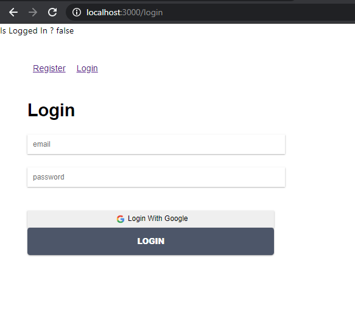

# 10 - Firebase di ReactJS

## Tujuan Pembelajaran

1. Konsep dan implementasi Firebase di ReactJS

## Hasil Praktikum

### Praktikum 1 - Membuat Form Register
1. Buat project baru React atau melanjutkan praktikum dari Codelab sebelumnya.
2. Buatlah komponen `Register.js` dalam folder `src/components`, lalu buat function Register.
    ```
    function Register(){

    }
    ```
3. Buat tiga variabel hooks dan menggunakan context di dalam function Register()
    
    

4. Buat konstanta `AuthContext` di `src/App.js`

    

5. Buat return form Register pada komponen function `Register()`.

    

6. Buat fungsi `handleForm` pada komponen Register yang sementara isinya seperti berikut. Nanti kita akan ganti dengan fungsi firebase.
    
    

7. Kemudian dibuat komponen `Header`. Buat file `Header.js` di `src/components`.
    
    

8. Kemudian buat file `routes.js` di folder `src/components`

    

9. Kita pindah ke file `src/App.js` yang menentukan tampilan render pada aplikasi React

    

10. Selanjutnya perlu disesuaikan style pada `App.css` sesuai pada modul
11. Hasil

    

### Praktikum 2 - Membuat Form Login
1. Buat komponen login di `src/components/Login.js` yang isinya sama persis dengan komponen `Register.js` hanya saja berbeda teks pada bagian `return`
2. Kemudian pada file `src/components/routes.js` kita tambahkan komponen `Login`
    
    

3. Hasil

    

### Praktikum 3 - Membuat Koneksi ke Firebase
1. Silakan buka terminal atau command prompt untuk memasang library firebase pada project React
    
    

2. buka web firebase di https://console.firebase.google.com/
3. Buat project baru dengan pilih Add project

    

4. Kemudian beri nama project

    

5. Langkah selanjutnya dapat mengaktifkan Google Analytics yang berfungsi untuk melacak pengguna yang mengakses aplikasi React kita. 

    

6. Jika kita memilih untuk mengaktifkan Google Analytics, maka akan tampil seperti pada gambar berikut untuk memilih pada akun mana akan diterapkan.

    

7. Selanjutnya, klik Create project untuk membuat project baru pada firebase. Tunggu hingga proses pembuatan project firebase selesai.
    
    

8. Selanjutnya pilih jenis aplikasi web untuk aplikasi React kita.

    

9. Setelah itu kita akan mendapatkan script konfigurasi yang akan menjadi penghubung dengan project React kita. Salin script tersebut lalu tempel pada file baru di dalam folder src yang kita beri nama `firebase.config.js`

    <br>
    

10. Kembali ke web firebase lalu pilih Authentication > get started, lalu bagian Sign-in method aktifkan untuk Email/Password dan Google sign-in.

    <br>
    

11. Jika sudah aktif kedua method sign-in tersebut, maka akan ada tanda enabled 
    
    

12. Jika telah berhasil memasang firebase, maka perlu kita import library tersebut di file `src/App.js` lalu inisiasi dengan konfigurasi firebase yang sudah didapat dari web firebase tadi.

    

13. Lalu buka komponen Register di `src/components/Register.js` lakukan tambahan import firebase dan ubah isi `handleForm` seperti berikut.

    

14. Jalankan. Hasilnya jika berhasil registrasi, maka status Is logged in? menjadi true.

    <br>
    <br>
    

15. Selanjutnya pada bagian login. Ubah bagian `handleForm` seperti berikut

    

16. Jalankan. Jika berhasil maka saat login status berubah menjadi true
    
    <br>
    