# 11 - Redux Thunks

## Tujuan Pembelajaran

1. Konsep dan implementasi Redux-Thunk di ReactJS
2. Konsep dan implementasi Firebase Login dengan Redux-Thunk di ReactJS

## Hasil Praktikum

### Praktikum 1 - Membuat Login dengan Firebase dan Redux Thunk
1. Buat project baru React atau melanjutkan praktikum dari Codelab sebelumnya.
2. Ubahlah isi kode `firebase.config.js`

    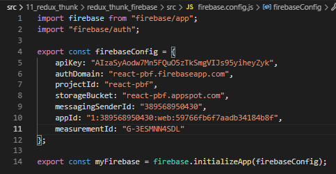

3. Buatlah folder dan file baru di `src/redux/actions/auth.js`.

    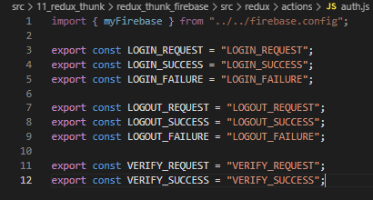

4. Tambahkan fungsi action dibawahnya

    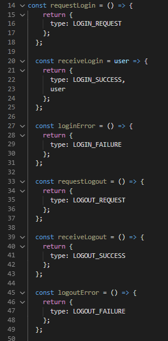

5. Lalu tambahkan juga dibawahnya fungsi untuk login, logout, dan verifikasi akun dengan firebase .

    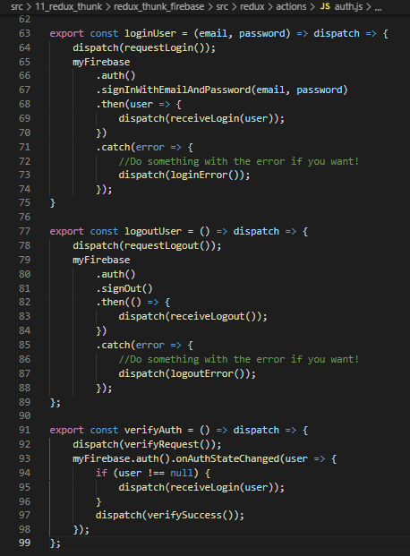

6. Selanjutnya buat folder dan file baru di `src/redux/reducers/auth.js`.
    
    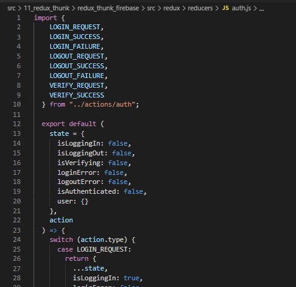

7. Buat file baru `index.js` di folder `reducers`
    
    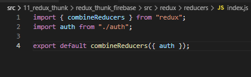

8. Buat file baru di `src/redux/configureStore.js` untuk mengonfigurasi store kita dengan Redux Thunk.

    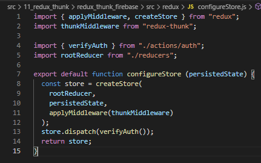

### Membuat Form Login dan Halaman Home

9.  Buat komponen form Login. Buka file `Login.js` di `src/components`

    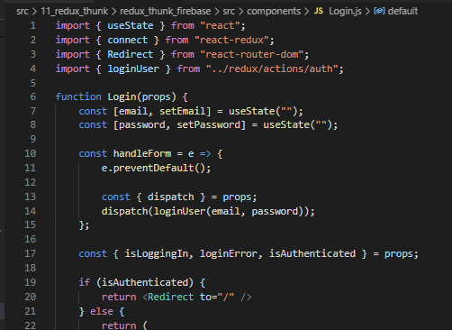

10. Kemudian buat file `Home.js` di folder `src/components`
    
    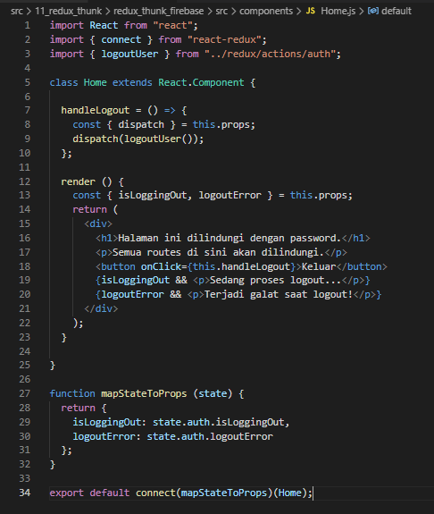

### Membuat Route yang Terproteksi

11. Buatlah folder dan file baru di `src/routes/protectedRoute.js`

    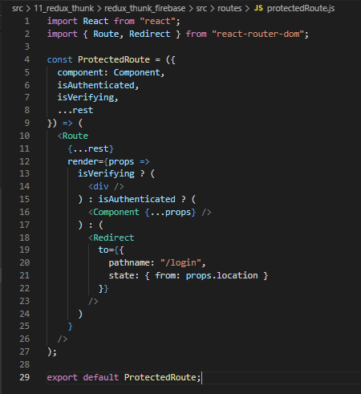

### Membuat App Utama

12. Buat komponen Root yang berfungsi untuk memverifikasi user yang sudah terautentikasi atau belum, sehingga bisa dilakukan kontrol terhadap route ke App kita. Buatlah file baru di `src/Root.js`.

    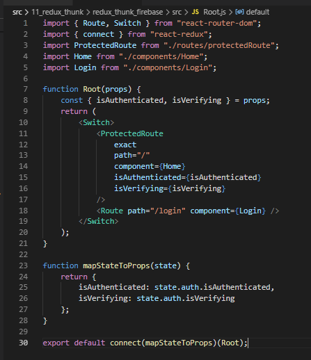

13. Kita pindah ke file `src/App.js` yang menentukan tampilan render pada aplikasi React kita.

    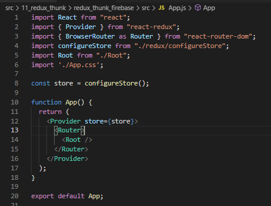

14. Simpan semua pekerjaan lalu lihat hasilnya di browser.

    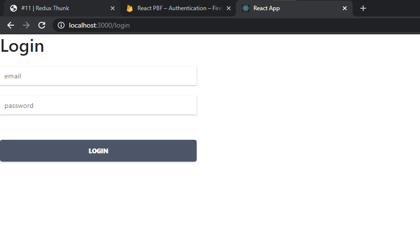

15. Kemudian coba lakukan login dengan email dan password yang telah didaftarkan sebelumnya di firebase. Jika login sukses, maka akan mengarah ke komponen `Home`

    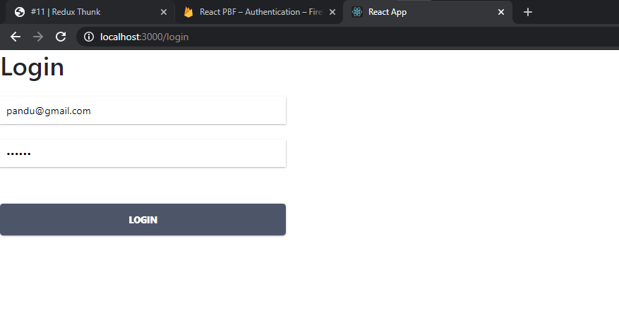 
    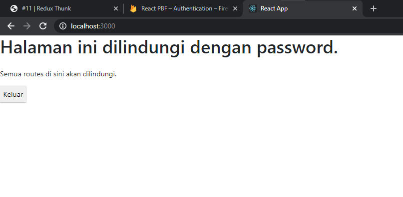

## Tugas

Soal :
1. Berdasarkan praktikum yang telah Anda lakukan, jelaskan perbedaan fitur yang ada dalam komponen Login dan Home! Mengapa komponen Login tidak menggunakan class seperti pada komponen Home ?

2. Jelaskan kegunaan dan alur logika dari protectedRoute.js !

3. Coba lakukan login dengan email atau password yang salah, apa yang terjadi? Jelaskan!

4. Jika Anda berada di halaman Home, coba akses form login tanpa melakukan logout. Apakah form login bisa diakses? Jelaskan!

5. Tambahkan menu Register pada form login sehingga user yang belum terdaftar dapat melakukan registrasi! Jika registrasi sukses, maka user langsung diarahkan ke halaman Home.