# 12 - CRUD di Firebase

## Tujuan Pembelajaran

1. Konsep dan implementasi CRUD dengan Firebase di ReactJS

## Hasil Praktikum

### Praktikum 1 - Konfigurasi Database di Firebase
1. Silakan buka console Firebase Anda dengan melanjutkan project dari codelab 10 dan 11. Lalu pilih menu Realtime Database di sidebar kiri > klik Create Database.

    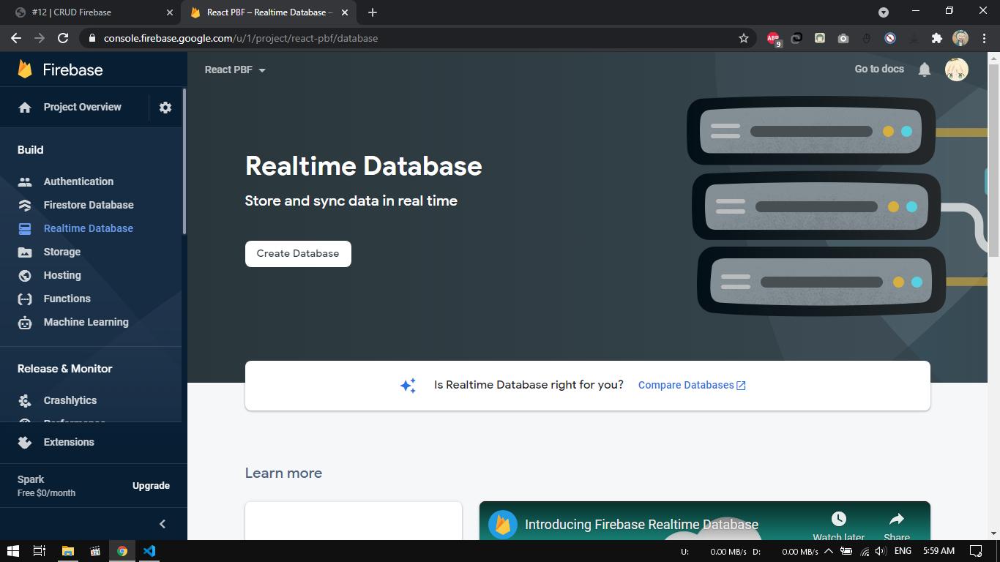

2. Pilih lokasi server terdekat, yaitu Singapore.

    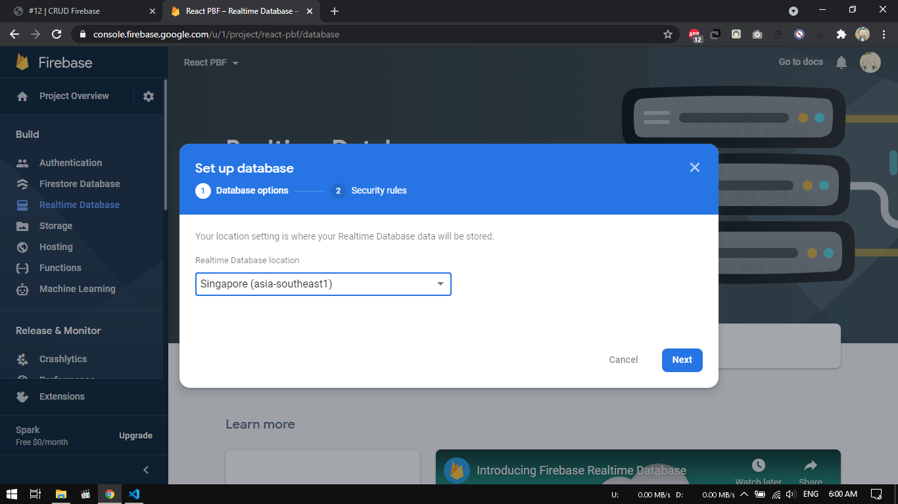

3. Lalu pada langkah kedua Security rules, kita pilih locked mode, artinya database kita masih dalam proteksi (tidak dapat dibaca dan ditulis).

    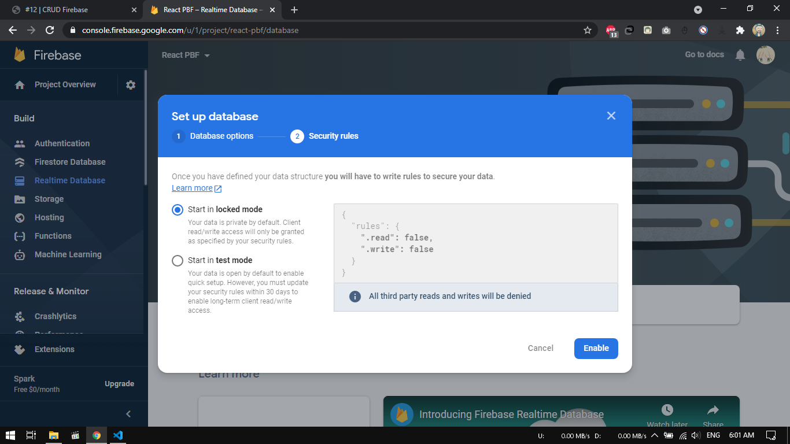

4. Pada Project Setting, Pilih Config pada bagian SDK setup and configuration untuk mendapatkan nilai konfigurasi Firebase yang akan kita gunakan pada aplikasi React.

    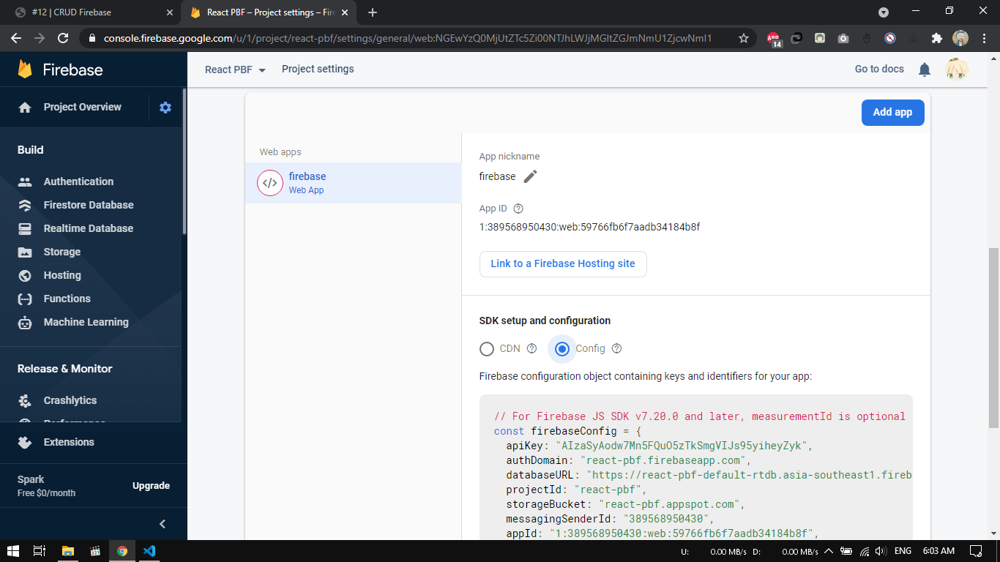

5. Ubahlah isi kode firebase.config.js seperti berikut.

    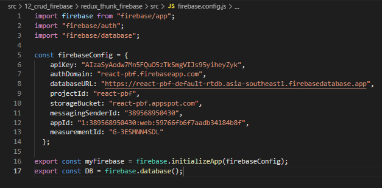

6. Lalu pada menu Realtime Database > pilih tab Rules, kemudian Edit rules seperti pada gambar berikut.
    
    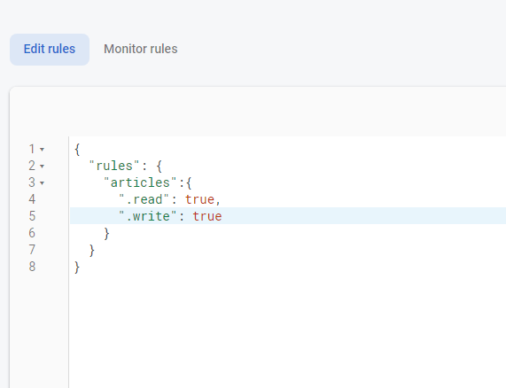

### Praktikum 2 - Membuat Fungsi Create Artikel

1. Pertama, pastikan variabel DB sudah kita import dari file firebase.config. Karena Global API sudah digantikan dengan firebase, maka boleh kita hapus atau comment saja.

    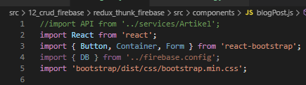

2. Kemudian fungsi ambilDataDariServerAPI diganti dengan kode berikut.

    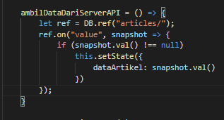

3. Kita tambahkan fungsi baru untuk menyimpan data artikel ke database firebase. 

    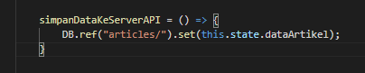

4. Selanjutnya ganti isi fungsi handleTombolSimpan dengan kode berikut.

    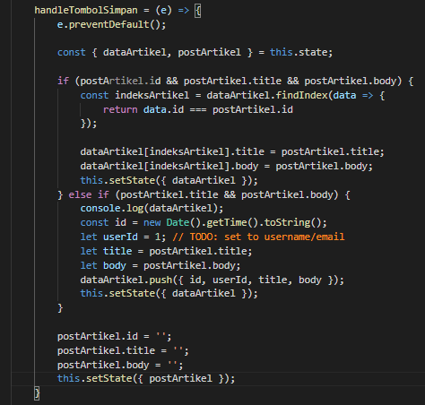

5. Lalu tambahkan fungsi componentDidUpdate seperti berikut.
    
    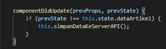

6. Terakhir kita sesuaikan fungsi render seperti berikut dengan komponen dari react-bootstrap. 

    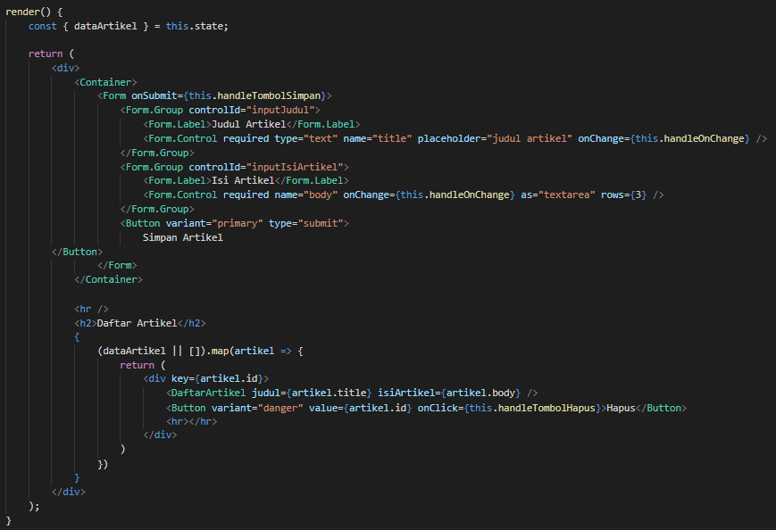

7. Lalu kita import komponen BlogPost ke komponen Home (dari Codelabs 11), agar komponen artikel hanya dapat diakses oleh akun yang telah login seperti pada gambar berikut.

    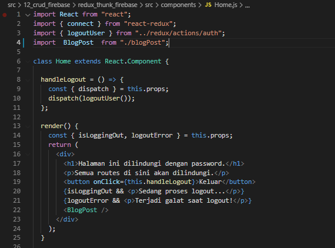

8. 
