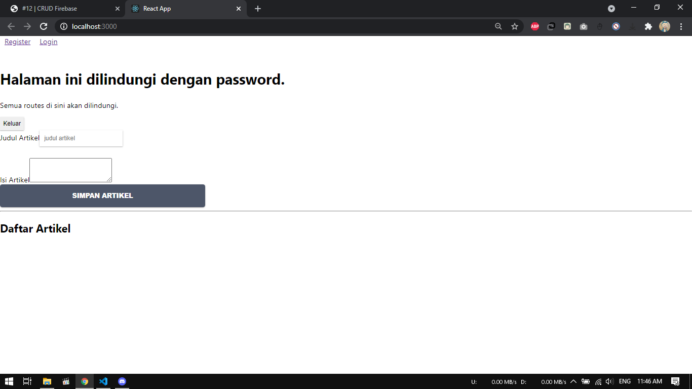
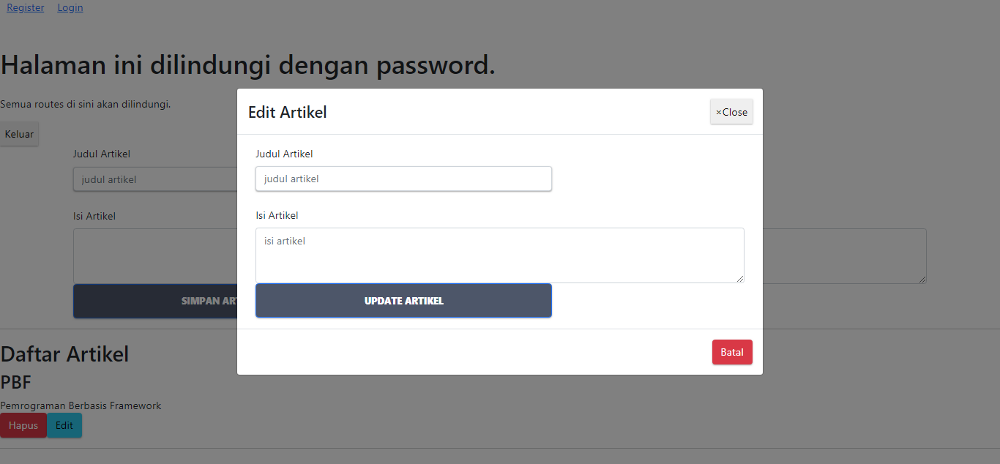

# 12 - CRUD di Firebase

## Tujuan Pembelajaran

1. Konsep dan implementasi CRUD dengan Firebase di ReactJS

## Hasil Praktikum

### Praktikum 1 - Konfigurasi Database di Firebase
1. Silakan buka console Firebase Anda dengan melanjutkan project dari codelab 10 dan 11. Lalu pilih menu Realtime Database di sidebar kiri > klik Create Database.

    

2. Pilih lokasi server terdekat, yaitu Singapore.

    

3. Lalu pada langkah kedua Security rules, kita pilih locked mode, artinya database kita masih dalam proteksi (tidak dapat dibaca dan ditulis).

    

4. Pada Project Setting, Pilih Config pada bagian SDK setup and configuration untuk mendapatkan nilai konfigurasi Firebase yang akan kita gunakan pada aplikasi React.

    

5. Ubahlah isi kode firebase.config.js seperti berikut.

    

6. Lalu pada menu Realtime Database > pilih tab Rules, kemudian Edit rules seperti pada gambar berikut.
    
    

### Praktikum 2 - Membuat Fungsi Create Artikel

1. Pertama, pastikan variabel DB sudah kita import dari file firebase.config. Karena Global API sudah digantikan dengan firebase, maka boleh kita hapus atau comment saja.

    

2. Kemudian fungsi ambilDataDariServerAPI diganti dengan kode berikut.

    

3. Kita tambahkan fungsi baru untuk menyimpan data artikel ke database firebase. 

    

4. Selanjutnya ganti isi fungsi handleTombolSimpan dengan kode berikut.

    

5. Lalu tambahkan fungsi componentDidUpdate seperti berikut.
    
    

6. Terakhir kita sesuaikan fungsi render seperti berikut dengan komponen dari react-bootstrap. 

    

7. Lalu kita import komponen BlogPost ke komponen Home (dari Codelabs 11), agar komponen artikel hanya dapat diakses oleh akun yang telah login seperti pada gambar berikut.

    

8. Hasil. Saat artikel ditambahkan, akan masuk kedalam daftar artikel dibawahnya dan masuk kedalam database di firebase

     
     
    

### Praktikum 3 - Membuat Fungsi Hapus Artikel
1. Kembali ke komponen BlogPost, ganti isi fungsi handleTombolHapus seperti berikut.

    

2. Hasil. Jika tombol hapus ditekan, maka muncul alert data telah dihapus

     
    

### Praktikum 4 - Membuat Fungsi Edit (Update) Artikel
1. Kembali ke komponen BlogPost, kita buat form edit-nya terlebih dahulu di bagian fungsi render(). Bisa diletakkan dipaling bawah setelah daftar artikel. Di sini kita menggunakan Modal dari react-bootstrap.

    

2. Lalu pada bagian state class BlogPost, kita perlu tambahkan showEdit seperti berikut.

    

3. Selanjutnya tambahkan tombol Edit pada Daftar Artikel sebelah tombol Hapus
4. Buat fungsi handleTombolEdit pada komponen BlogPost seperti berikut

    

5. Hasil

    

## Tugas
1. Berdasarkan praktikum 1 yang telah Anda lakukan, jelaskan perbedaan fungsi locked mode dan test mode pada langkah 3 saat Anda konfigurasi database Firebase?

    Jawab :

    Pada `locked mode` hanya user yang terdaftar yang dapat melakukan perubahan data di database sedangkan pada `test mode` mengizinkan semua orang mengakses database

2. Buatlah variabel userId pada praktikum 2 langkah 4 agar dapat menyimpan email dari user yang sedang login, sehingga dapat tersimpan di database!

    Jawab :

    - import `myFirebase` kedalam blogPost

        

    - pada handleTombolSimpan ubdah userId sebagai berikut
    
        
    
    - Hasil

        

3. Jelaskan maksud kode ini (dataArtikel || []) pada praktikum 2 langkah 6! Mengapa berbeda dari codelabs sebelumnya untuk menampilkan daftar artikel?

    Jawab :

    Kode diataas berfungsi untuk menampilkan map data dalam bentuk array/objek

4. Lengkapilah kode pada praktikum 4 langkah 5 agar dapat melakukan update artikel! Mengapa setelah klik tombol Update Artikel, form Modal tidak hilang? Bagaimana Anda mengatasi hal tersebut?
    
    Jawab :
    - Isi handleEdit

    

    - Tambahkan pada bagian awal modal
    
    

    - Hasil

     
    

5. Ketika Anda menekan tombol Edit, lalu menekan tombol Batal pada form Modal update artikel. Kemudian coba tambah artikel baru, maka artikel yang tadi kita klik tombol Edit akan berubah jadi data yang artikel baru ditambahkan. Mengapa demikian? Silakan diperbaiki.

    Jawab :
    
    Karena pada bagian edit menggunakan handleTombolSimpan sehingga data tertumpuk saat akan menambahkan artikel baru. Cara mengatasinya ialah :

    - Tambahkan pada bagian button batal

    

    - Membuka menu edit, kemudian klik tombol batal

    

    - Menambahkan artikel baru dan berhasil. Data tidak tertumpuk
    
    