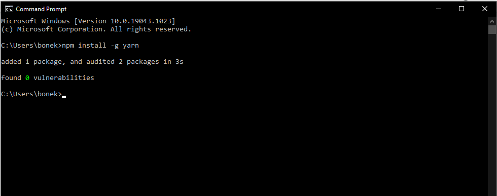
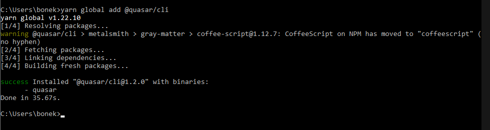
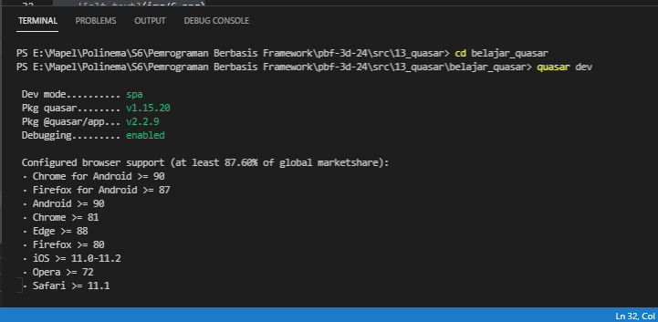
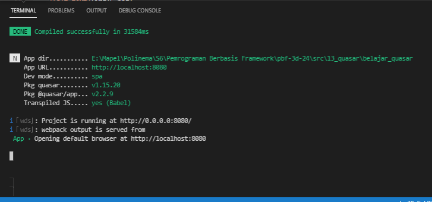
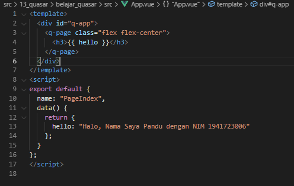
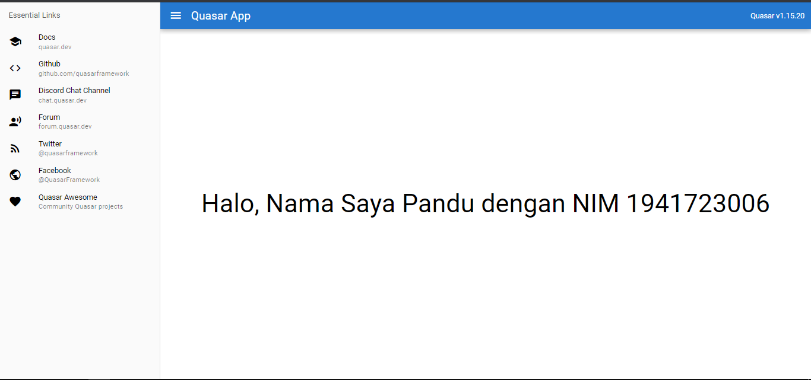

# 13 - Quasar Framework

## Tujuan Pembelajaran

1. Pengenalan dan instalasi Quasar Framework

## Hasil Praktikum

### Praktikum 1 - Memulai Quasar Framework
1. Buka CMD atau terminal pada OS Anda, lalu ketik perintah berikut untuk install Quasar CLI.

     
    

2. Setelah proses instalasi Yarn dan Quasar berhasil, selanjutnya kita buat folder project Quasar baru

    

3. Selanjutnya buka folder project Quasar tersebut "belajar_quasar" dengan VS code, lalu buka terminal dan jalankan perintah `quasar dev` untuk melihat hasil aplikasi di browser.

     
    

### Praktikum 2 - Membuat Aplikasi Pertama

1. Sekarang kita coba buat kode pertama dengan buka file src > pages > Index.vue. Rubah kodenya menjadi berikut

    

2. Hasil

    

## Tugas
1. Berdasarkan praktikum 1 yang telah Anda lakukan, jelaskan kegunaan file quasar.conf.js ?

    Jawab:

    `quasar.conf.js` dapat mengatur konfigurasi website secara dinamis berdasarkan modul. Sumber: https://quasar.dev/quasar-cli/quasar-conf-js

2. Jelaskan maksud istilah SPA, SSR, PWA, BEX, Electron app, Cordova, dan Linting code!

    Jawab :

    - SPA : web atau situs web yang berinteraksi dengan pengguna dengan secara dinamis menulis ulang halaman saat ini daripada memuat seluruh halaman baru dari server. Sumber: https://quasar.dev/quasar-cli/developing-spa/introduction

    - SSR : Quasar dan Vue.js adalah kerangka kerja untuk membangun aplikasi sisi klien. Secara default, komponen Quasar Vue menghasilkan dan memanipulasi DOM di browser sebagai output. Namun, juga dimungkinkan untuk merender komponen yang sama ke dalam string HTML di server, mengirimkannya langsung ke browser, dan akhirnya "menghidrasi" markup statis menjadi aplikasi yang sepenuhnya interaktif di klien. Sumber: https://quasar.dev/quasar-cli/developing-ssr/introduction

    - PWA : Metode pembuatan software dengan mengkombinasikan antara website reguler dengan aplikasi mobile & desktop. Sumber : https://www.softwareseni.co.id/blog/progressive-web-application-pwa

    - BEX : Ada dua jenis extension yang umum. Sebagian besar memperluas fungsionalitas browser itu sendiri atau mengintegrasikan layanan yang ada dengan browser. Sumber : https://www.howtogeek.com/718676/what-is-a-browser-extension/

    - Electron App : Kerangka kerja sumber terbuka yang dibuat oleh Cheng Zhao, dan sekarang dikembangkan oleh GitHub. Ini memungkinkan pengembangan aplikasi GUI desktop menggunakan komponen front dan back end yang awalnya dikembangkan untuk aplikasi web: runtime Node.js untuk backend dan Chromium untuk frontend. Electron adalah kerangka kerja GUI utama di balik beberapa proyek sumber terbuka terkenal termasuk Atom GitHub dan editor kode sumber Visual Studio Code Microsoft, aplikasi desktop layanan streaming musik Tidal dan Light Table IDE, selain klien desktop freeware untuk layanan obrolan Discord. Sumber: https://quasar.dev/quasar-cli/developing-electron-apps/introduction

    - Cordova : Cordova memungkinkan pengembang untuk membuat aplikasi mobile dengan menggunakan CSS3, HTML5 dan JavaScript daripada menggunakan API yang spesifik untuk masing-masing platform seperti Java untuk Android, Swift untuk iOS dan C# untuk Windows Phone. Dengan satu kode sumber yang sama, Apache Cordova dapat membungkus aplikasi agar dapat berjalan di banyak jenis device. Sumber : https://www.codepolitan.com/membuat-aplikasi-android-berbasis-html5-cordova

    - Linting Code : Linting code: Adalah pemeriksaan otomatis kode sumber Anda untuk kesalahan program dan gaya. Ini dilakukan dengan menggunakan alat lint (atau dikenal sebagai linter). Alat lint adalah penganalisis kode statis dasar. Sumber: https://www.perforce.com/blog/qac/what-lint-code-and-why-linting-important#what-is

3. Jelaskan maksud dan perbedaan ES6, ECMAScript 6, dan ECMAScript 2015 !

    Jawab :

    ES6 adalah sebuah singkatan dari ECMAScript versi 6. ES6 release pada tahun 2015, jadi ES6 sama ES 2015 sama aja. Lalu apa itu ECMAScript? ECMAScript adalah sebuah standarisasi scripting language (Javascript) yang dibuat oleh European Computer Manufacturers Association (ECMA). Bahasa gampangnya ECMAScript itu standarnya, Javascript itu implementasinya. Sumber : https://medium.com/@renopp/kenalan-dengan-es6-javascript-introduction-variable-arrow-function-part1-6bd5c148473b