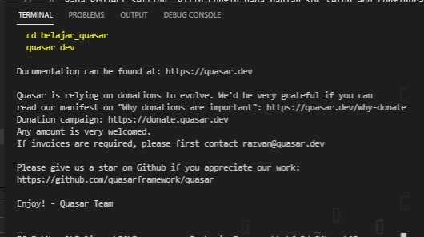

# 13 - Quasar Framework

## Tujuan Pembelajaran

1. Pengenalan dan instalasi Quasar Framework

## Hasil Praktikum

### Praktikum 1 - Memulai Quasar Framework
1. Buka CMD atau terminal pada OS Anda, lalu ketik perintah berikut untuk install Quasar CLI.

     
    

2. Setelah proses instalasi Yarn dan Quasar berhasil, selanjutnya kita buat folder project Quasar baru

    

3. Selanjutnya buka folder project Quasar tersebut "belajar_quasar" dengan VS code, lalu buka terminal dan jalankan perintah `quasar dev` untuk melihat hasil aplikasi di browser.

     
    

### Praktikum 2 - Membuat Aplikasi Pertama

1. Sekarang kita coba buat kode pertama dengan buka file src > pages > Index.vue. Rubah kodenya menjadi berikut

    

2. Hasil

    

## Tugas
1. Berdasarkan praktikum 1 yang telah Anda lakukan, jelaskan kegunaan file quasar.conf.js ?

    Jawab:

    `quasar.conf.js` dapat mengatur konfigurasi website secara dinamis berdasarkan modul