# 14 - Quasar Directives dan Components

## Tujuan Pembelajaran

1. Pengenalan Quasar Directives
2. Pengenalan Quasar Components

## Hasil Praktikum

### Praktikum 1 - Menggunakan Quasar Directives
1. Buat project quasar baru

    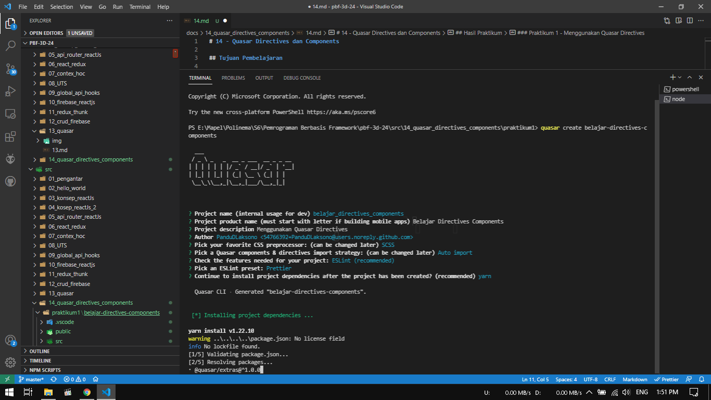 
    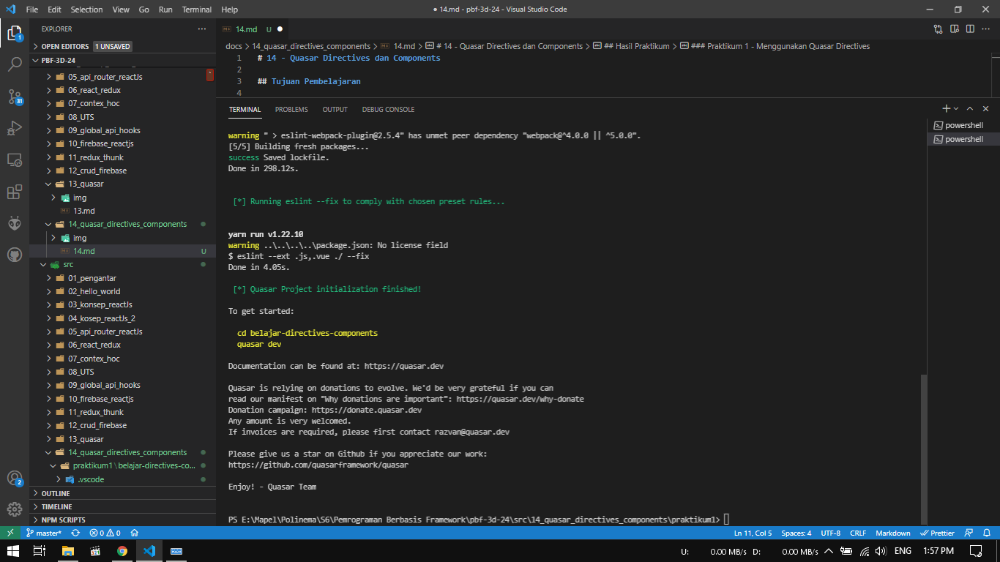

2. Selanjutnya kita definisikan directive Ripple yang akan digunakan pada file quasar.conf.js

    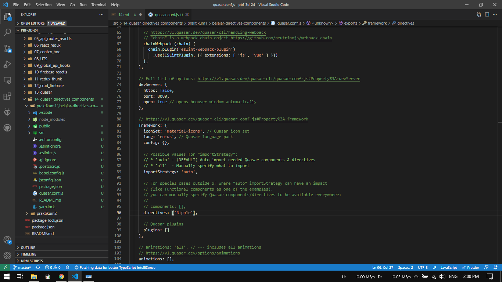

3. Setelah itu masuk ke folder `src > pages` pilih file `Index.vue` ganti kode template seperti berikut.

    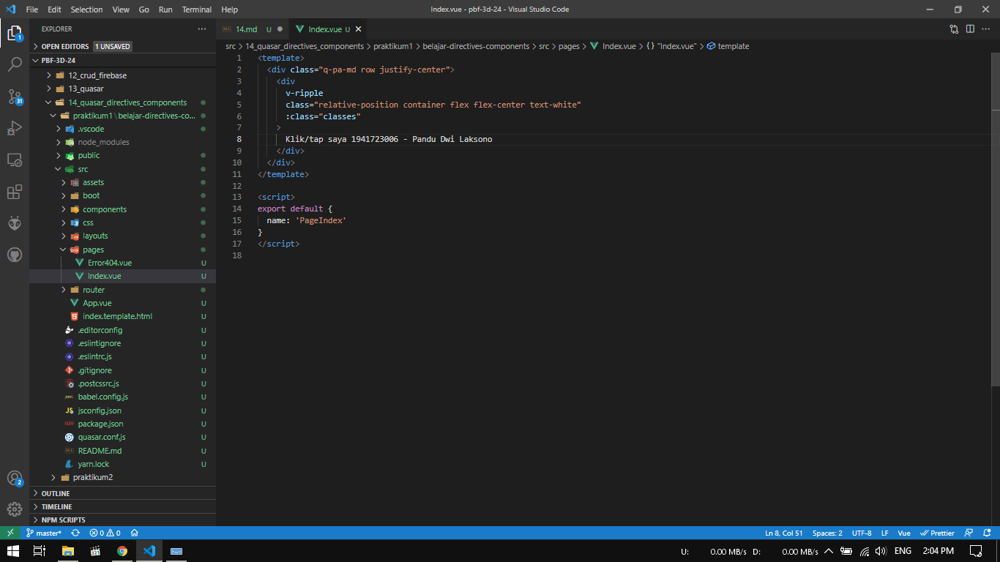

4. Selanjutnya kode `script` seperti berikut.

    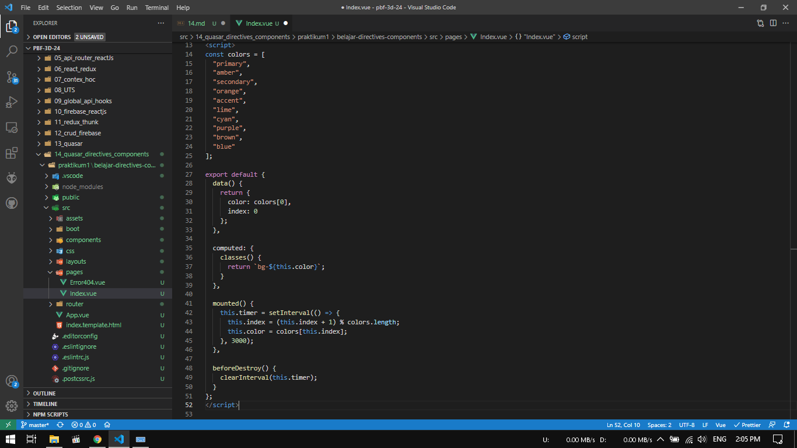

5. Untuk kode `style` ganti seperti berikut.

    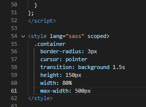

6. Kemudian silakan save dan run perintah `quasar dev` untuk melihat hasilnya di browser. Seharusnya tampil seperti pada gambar berikut. Jika area berwarna kuning di klik/tap, maka akan ada efek Ripple.

    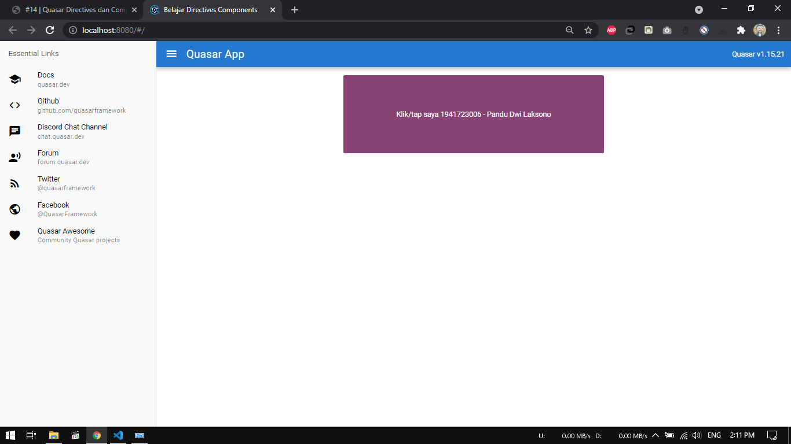 
    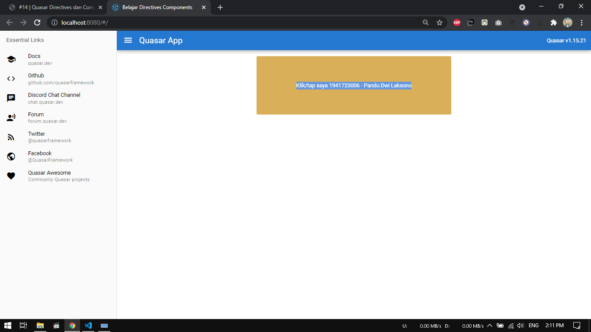

### Praktikum 2 - Membuat Aplikasi Pertama

1. Pertama, sebelum kita menggunakan `Button` dan `Icon`, perlu kita definisikan komponen yang dibutuhkan pada file `quasar.conf.js`

    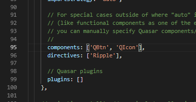

2. Selanjutnya kita ubah kode HTML di `src > pages > Index.vue` seperti berikut.

    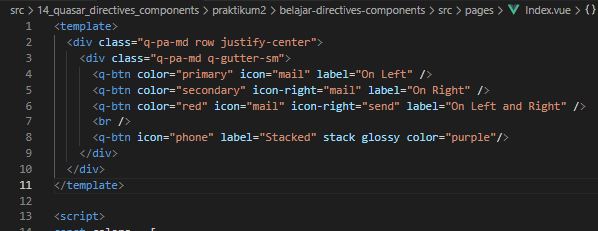

3. Lihat hasilnya di browser. Seharusnya tampil seperti gambar berikut.

    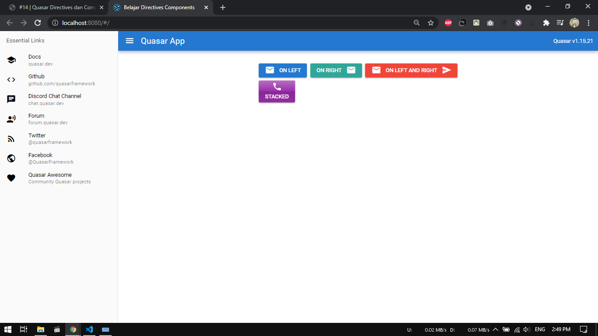

## Tugas
1. Berdasarkan praktikum 1 yang telah Anda lakukan, jelaskan maksud kode di template: `class="q-pa-md row justify-center"` ?

    Jawab :

    Maksud dari kode diatas ialah menempatkan semua konten yang ada pada class tersebut di tengah halaman web dengan rata

2. Berdasarkan praktikum 1 pada langkah nomor 4, jelaskan maksud script tersebut seperti kegunaan konstanta `colors, fungsi data(), computed, mounted, dan beforeDestroy()` !

    Jawab :

    - `colors` : berisi list warna dalam bentuk array yang nantinya akan ditampilkan pada bagian nim-nama secara bergantian
    - `fungsi data()` : mengembalikan warna / colors
    - `computed` : properti dalam computed mengolah value yang berasal dari data, menyimpannya dalam cache dan mengembalikannya
    - `mounted` : fungsi yang mengatur perubahan warna sesuai interval yang diatur
    - `beforeDestroy()` : fungsi untuk memanggil `this.timer` sebelum instance dihancurkan

3. Berdasarkan praktikum 2 pada langkah nomor 2, jelaskan maksud tiap kode HTML pada template yang mendefinisikan tiap `button` tersebut!

    Jawab : 

    a. <q-btn color="primary" icon="mail" label="On Left" /> : color "primary" untuk mengatur warna menjadi biru, icon "mail" untuk mengambil icon email, label "On Left" untuk text pada button

    b. <q-btn color="secondary" icon-right="mail" label="On Right" /> color "secondary" untuk mengatur warna menjadi aqua, icon "mail" untuk mengambil icon email, label "On Right" untuk text pada button
    
    c. <q-btn color="red" icon="mail" icon-right="send" label="On Left and Right" /> color "red" untuk mengatur warna menjadi merah, icon "mail" untuk mengambil icon email, icon-right "send" untuk mengatur icon menjadi send dan diposisi bagian kanan, label "On Left and On Right" untuk text pada button
    
    d. <q-btn icon="phone" label="Stacked" stack glossy color="purple"/>icon "phone" untuk mengambil icon telepon, label "Stacked" untuk text pada button, stack glossy untuk memberikan efek berkilau, color "purple" untuk mengatur warna button menjadi ungu

    

4. Coba ganti kode template HTML pada praktikum 2 menjadi seperti pada codelab. Save file, lalu perhatikan apa yang terjadi ? Mengapa terjadi demikian, jelaskan!

    Jawab :

    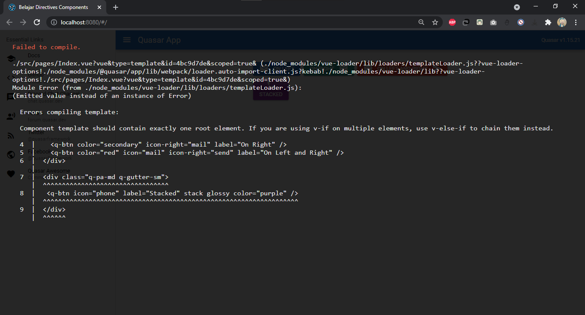

    Terjadi error karena pada react framework root element hanya bisa satu

